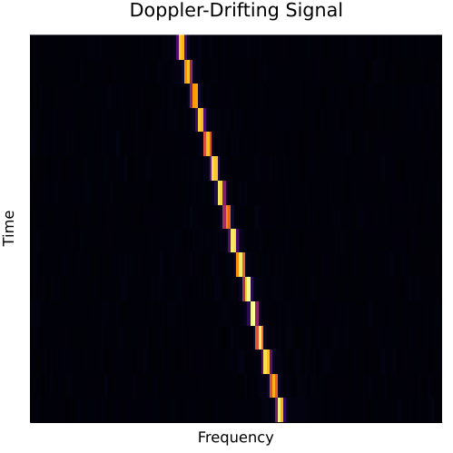
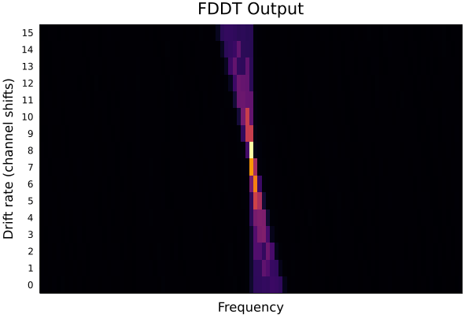
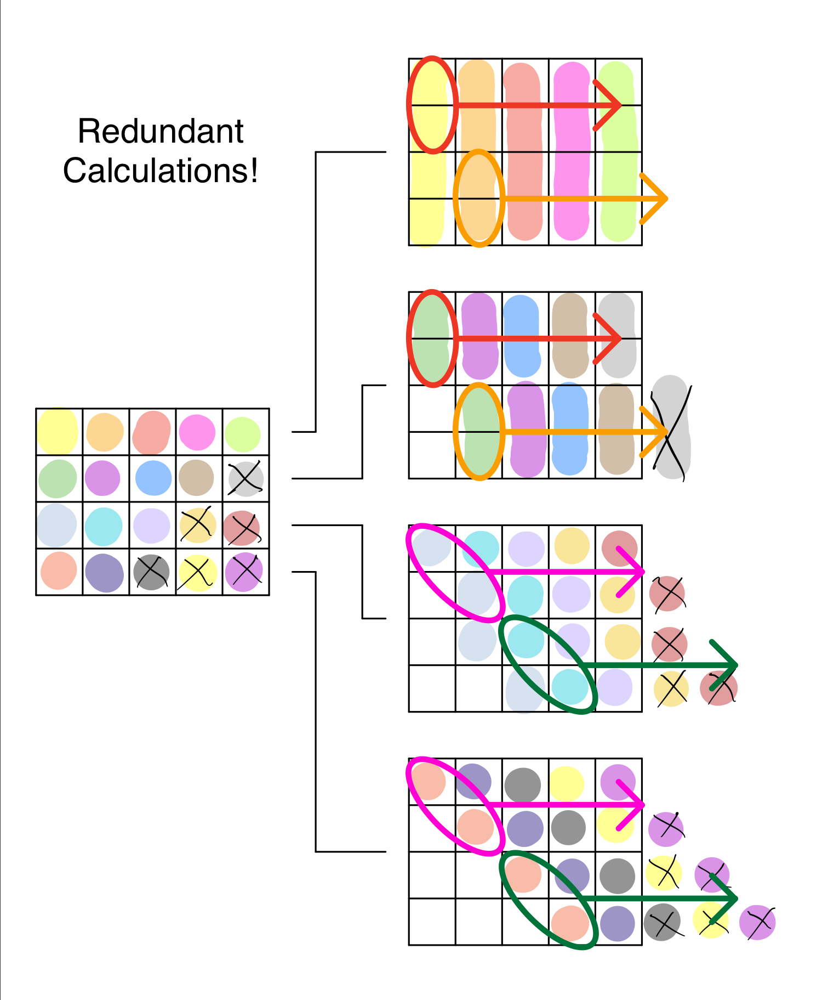
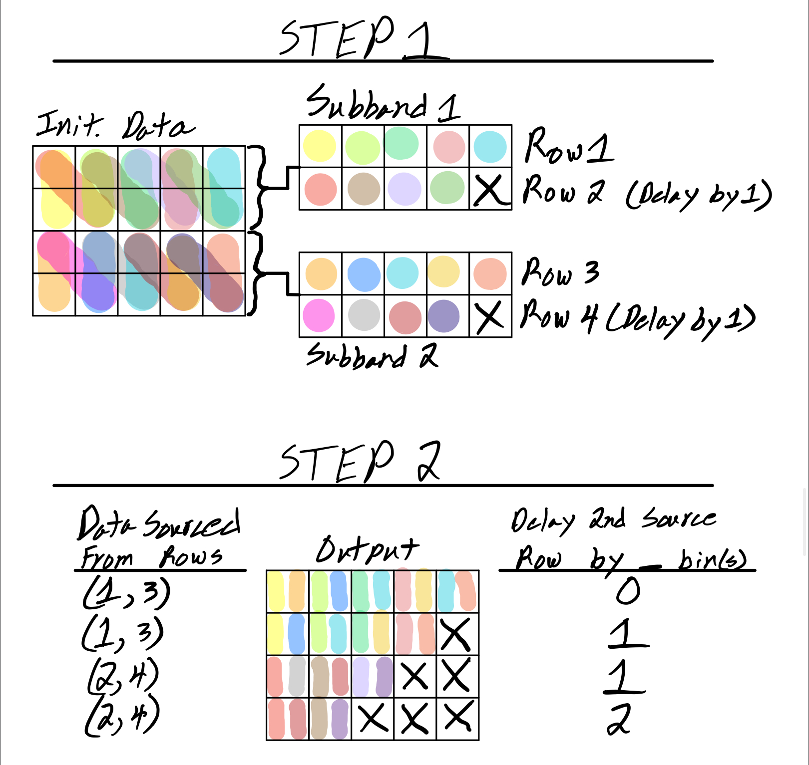
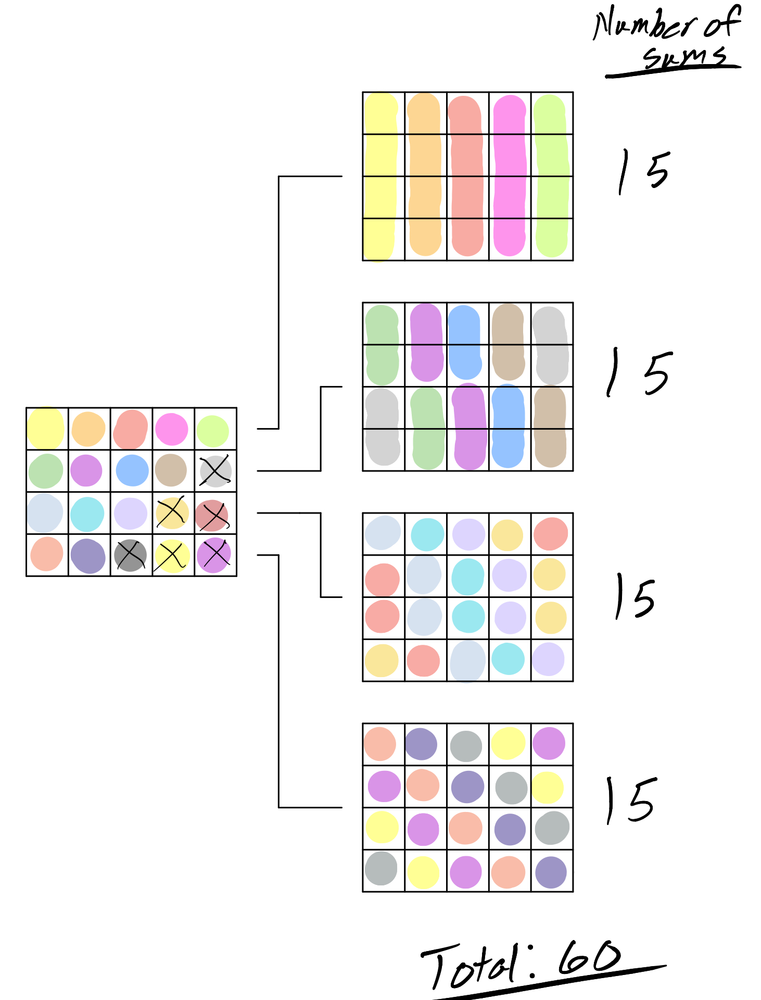
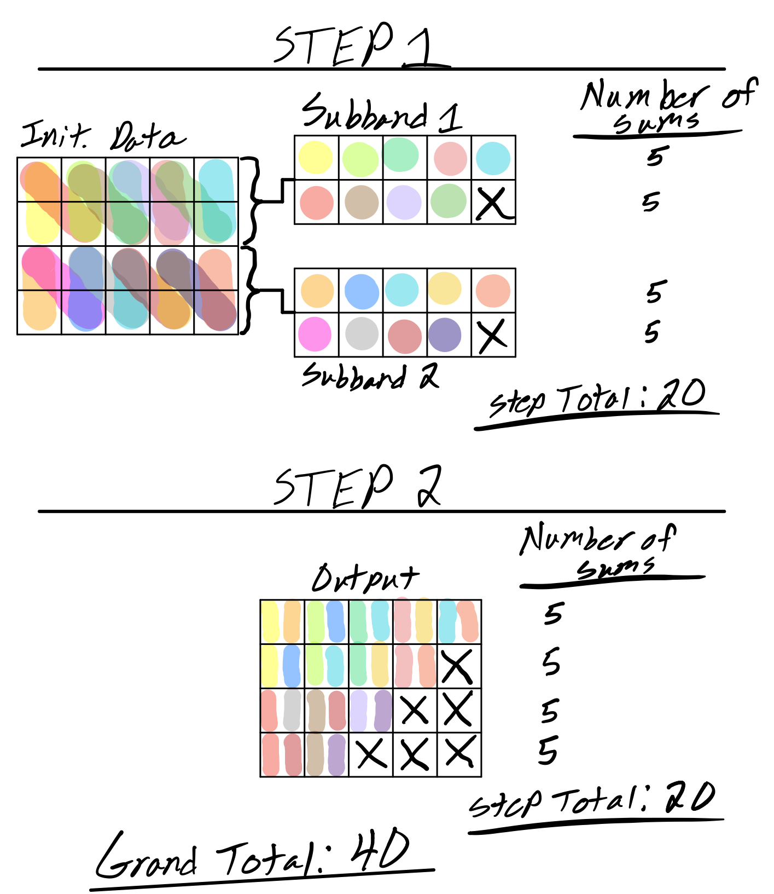

# FastDeDopplerTransform.jl

This package contains CPU and GPU implementations of the Fast DeDoppler Transform (FDDT) -
an algorithm similar to, and based-off of the Fast Dispersion Measure Transform (FDMT)
described by [Zackay and Ofek](https://arxiv.org/abs/1411.5373).

This algorithm is used to search for doppler-drifting radio signals in frequency/time space
in a more efficient manner than brute-force methods.

## Details

### Inputs

- 2D array containing time vs frequency power data
- Time sample width (seconds)
- Frequency bin width (Hz)
- Minimum and Maximum drift rates to search between (Hz/s)

### Output

- 2D array containing the drift-space intensities vs frequency channel
- TODO: Frequency, time, and other info needed to interpret output

Compute Complexity: $N_f * N_{drift} * log_2(N_t)$

Memory Requirements: $2 * N_{drift} * N_f$

### Frequency Scrunching

- With large drift rates and small number of input time samples, the frequency dimension
must be scrunched (every N channels summed together) to achieve the desired results. This
decreases sensitivity and should be avoided. See
[Zackay and Ofek](https://arxiv.org/abs/1411.5373) section 2 and the bottom of page 4 for
more details.

## Example

Given the radio spectrogram below containing a linearly drifting signal,

the algorithm outputs the following:

The highest intensity point is found at location (51,9) meaning the most likely doppler-drifting
signal candidate started at frequency channel 51 and drifts 8 (9-1 because of zero drift
rate at index 1) channels over the timespan contained in the input spectrogram.

## Comparison to other dedoppler methods

TODO:

## How it works

The output of FDDT is a matrix of drift rates vs frequency channel, so the first row contains
the sum of input data across time with zero drift (straight sum of one complete channel).
The second row contains the sum of input data with a drift rate of one channel, the third,
two channels, and so on.

This is best shown in the plot below where the highlighted colors
show what input data is summed to create the output data. X's indicate where the output data
is invalid since the required drift rate and channel index leads to out-of-bounds memory
acceses. These values can be handled by either zeroing that data or filling it with the input
mean or NaNs.

As you may have seen though, there are many chances for data reuse. For example, a delay of 0 at
frequency channel 2 contains data that is used in the output data of a delay of 1 at
frequency channel 1. The redundant summing operations are shown below by matched ovals that get
repeated across the rows. The major difference between the brute-force dedoppler algorithm and FDDT is that FDDT eliminates these redundant calculations.

It does this by breaking the process into a series of steps where 2 sets of input rows (so-called subbands) of data are summed and shifted to create 1 output subband comprised of twice as many rows of data as each of the input subbands. The top output row of each subband is the vertical sum (zero shift) of the two input rows, and each row below that increases the shift by one frequency bin.

The first step of this process always starts with the smallest subbands you can have: 1 row of input data. This input data isn't always data from the input spectrogram (we'll get to this later), but for now, let's just call this data 'initialized data' (init. data). During this first step, two subbands (1 row of data each) of the initialized data are summed vertically for each frequency channel to create the top row of the output subband (which in total is comprised of 2 rows of output data). Then, the 'lower' input subband is shifted/delayed by 1 channel before summing vertically again for all frequency channels but the last (because this does not contain valid data after the shift). The result of this vector-vector summation is the second row of the output subband.

The above process is repeated $log_2(N_t)$ times to handle all input rows where the output of the current step becomes the input to the next step.

The second step follows the principles of the first step while operating on twice the amount of rows per subband and relying on slightly different shifts per row and data source row indices. For the simple data shown above, the FDDT algorithm is finished after these two steps. See the diagrams below for a visual interpretation of the above steps.

For larger input data sizes, more steps are needed, but the process is the same. The source row and shift calculations follow the same pattern for all steps, so they are executed on-the-fly rather than all at once.

Let's calculate how many operations FDDT saved us compared to the brute-force dedoppler algorithm.

For brute-force:

For FDDT:

Number of operations saved: 20 (33% reduction)

### Initialization Phase

FDDT is comprised of two parts: an initialization phase and an execution phase (shown above).

In the initialization phase, the output matrix is initialized according to the given
parameters passed in by the user. Depending on these parameters, the data is either initialized
directly with the input data, or with input data where the frequency dimension is reduced by summing every N
frequency channels together.

This reduction is necessary when high-drift rates cause the maximum drift per time sample to surpass a single frequency channel.

For example, given an input spectrogram with 1 second time samples and 1 Hertz frequency bins, any doppler-drifting signal with a drift rate greater than 1 Hz/s would have its power located in multiple frequency channels. Thus, these channels must be summed to capture all the power from the signal.
