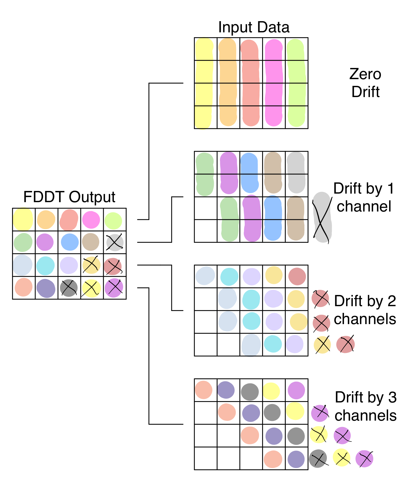

# FastDeDopplerTransform.jl

This package contains CPU and GPU implementations of the Fast DeDoppler Transform (FDDT) -
an algorithm similar to, and based-off of the Fast Dispersion Measure Transform (FDMT)
described by [Zackay and Ofek](https://arxiv.org/abs/1411.5373).

This algorithm is used to search for doppler-drifting radio signals in frequency/time space
in a more efficient manner than brute-force methods.

## Details

### Inputs

- 2D array containing time vs frequency spectrogram data
- Time sample width (seconds)
- Frequency bin width (Hz)
- Minimum and Maximum drift rates to search between (Hz/s)

### Output

- 2D array containing the drift-space intensities vs frequency channel
- TODO: Frequency, time, and other info needed to interpret output

Compute Complexity: $N_f * N_{drift} * log_2(N_t)$

Memory Requirements: $2 * N_{drift} * N_f$

### Frequency Scrunching

- With large drift rates and small number of input time samples, the frequency dimension
must be scrunched (every N channels summed together) to achieve the desired results. This
decreases sensitivity and should be avoided. See
[Zackay and Ofek](https://arxiv.org/abs/1411.5373) section 2 and the bottom of page 4 for
more details.

## Example

Given the radio spectrogram below containing a linearly drifting signal,

the algorithm outputs the following:

The highest intensity point is found at location (51,9) meaning the most likely doppler-drifting
signal candidate started at frequency channel 51 and drifts 8 (9-1 because of zero drift
rate at index 1) channels over the timespan contained in the input spectrogram.

## Comparison to other dedoppler methods

TODO:

## How it works

The output of FDDT is a matrix of drift rates vs frequency channel, so the first row contains
the sum of input data across time with zero drift (straight sum of one complete channel).
The second row contains the sum of input data with a drift rate of one channel, the third,
two channels, and so on.

This is best shown in the plot below where the highlighted colors
show what input data is summed to create the output data. X's indicate where the output data
is invalid since the required drift rate and channel index leads to out-of-bounds memory
acceses. These values can be handled by either zeroing that data or filling it with the input
mean or NaNs.

As you can see though, there are many chances for data reuse. For example, a delay of 0 at
frequency channel 2 contains data that is used in the output data of a delay of 1 at
frequency channel 1. The redundant summing operations are shown below by matched ovals that get
repeated across the rows. The FDDT algorithm takes advantage of and eliminates these opportunities for data reuse.

FDDT is comprised of two parts: an initialization phase and an execution phase.

In the initialization phase, the output matrix is initialized according to the given
parameters passed in by the user. Depending on these parameters, the data is either initialized
directly with the input data, or the frequency dimension is reduced by summing every N
frequency channels together.

For the execution phase, there are $log_2(N_{drift})$ steps where in each step, chunks of data
are shifted and summed to create the input for the next step of execution.

TODO: Show FDDT operation
